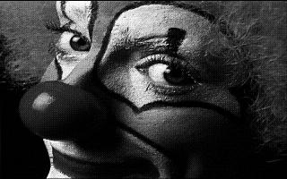
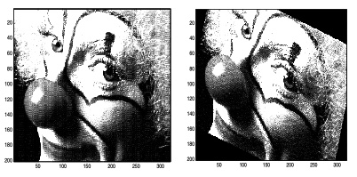
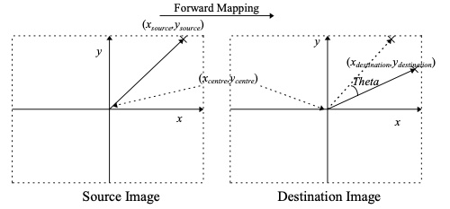
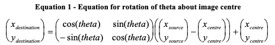
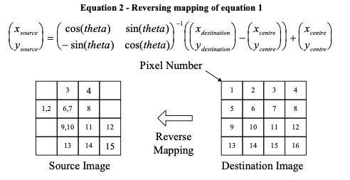
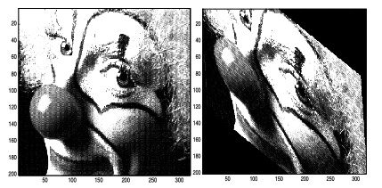
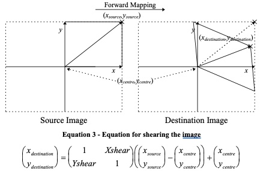

# Lab 1 - Introduction to Matlab

**_Peter Cheung, V1.2 - 15 January 2026_**

In this lab you will write some simple programs using MATLAB to  manipulate some 2D image data (as two-dimensional array) with simple matrix operations.  You will perform the following two geometric transformations:
* Rotation
* Shearing

---
## Installing MATLAB

If you do not have MATLAB installed on your laptop, please do so now by following instructions on this webpage:

https://www.mathworks.com/login/verification/tah/new

---
## Learning MATLAB Basics

If you don't have prior experience with Matlab, it is worth spending a bit of time going through Matlab's tutorial. You can find it here:

https://matlabacademy.mathworks.com/details/matlab-onramp/gettingstarted

This may take you some effort, but you will learn very valuable skills used in many high-tech companies.

---
## Loading the test image

To make things nice and easy for you we’ve given you an image to play with. The image shown below is a 200x320 grey scale image called “clown”.  Now run MATLAB on your laptop.

<p align="center">  </p>
To load the image into your workspace type:

```
» load clown
```

The image is stored as a 2 dimensional array of grey scale values in the range 0 to 1. 

You will see on the right window pane, there is a variable called 'clown' which is a 200 x 320 two-dimensional matrix containing the pixel (brightness) value of the image.  Note that the data type is 'double' and its value is between 0.0 and 1.0.

Now type

```
clown  (20,319)
```

Matlab responds with the greyscale value of the image at (319,20):
```
ans =
	0.1554
```

## Displaying Images

You can display the clown image using the built-in MATLAB function _imshow()_. Try this:
```
» imshow (clown)
```
---
## Task 1 - Image Rotation
---

### The Requirement

You are required to write a function which rotates a grey scale image by _theta_ degrees radian, as shown below.
<p align="center">  </p>

The function should have the following format:

```
	function [Out] =  Rotate(In, Theta)
```
Note the following:
* The resulting image should be the same size as the original. (i.e. the matrix storing the image should have the same dimensions, so some clipping of the image may occur).

* If a source pixel lies outside the image you should paint it black.

* Use “nearest pixel” only: for example if the source pixel required is (34.43,46.667) you should use the pixel at the location (34,47) in the source image.

* The rotation should be performed about the centre of the image.


>## Everything You Need To Know About Rotating Images

Just in case your maths is a bit rusty, here’s the basics of image rotation:
<p align="center">  </p>

<p align="center">  </p>

The way to perform the forward mapping would be as follows:

```
For each pixel in the source image
	{
	Work out the destination pixel location using the forward mapping equation.
	Paint that destination pixel with the source image value.
	}
```

>The problem with using the forward mapping directly is demonstrated in the figure below. Firstly there are pixels in the destination image with more than one source pixel. More of a problem is the fact that some pixels are never written to, leaving the destination image with holes!
<p align="center">  </p>

The way around this is to use the _**reverse mapping**_ equation in Equation 2. This works out where each destination pixel came from in the source image. This uses the **inverse** of the transformation matrix, which fortunately is easy to work out using the Matlab's **inv()** function.

<p align="center">  </p>

So the way to use the reverse mapping would be as follows:
```
Calculate the inverse transformation matrix
For each pixel in the destination image
	{
		Using the reverse mapping equation, ...
			Work out where the pixel maps to in the source image
		Paint the destination pixel with that source pixel value
	}
```

>You should read the explanation above and make an attempt with your lab partner(s) to figure out how you might approach the problem.  You may then choose to write your version of the function.  If you find this too difficult, don't worry.  You have been provided with the "model solution" in this repo under the folder 'solutions'.  Make sure that you understand how the MATLAB code works.


---
## Task 2 - Image Shearing
---

### The Requirement

You are required to write a function which shears the input image in both the x and y direction and centres the result, as shown in the figure below (using Xshear=0.1, Yshear=0.5).
<p align="center">  </p>

The function should have the following format:
```
	function [Out] =  Shear(In, Xshear, Yshear)
```
Note the following:
* The resulting image should be the same size as the original. (i.e. the matrix storing the image should have the same dimensions, so some clipping of the image may occur).

* If a source pixel lies outside the image you should paint it black.

* Use “nearest pixel” only, as before.
* You should centre the sheared result (i.e. the centre pixel of the image remains stationary).
* The shear values (Xshear, and Yshear) should be expressed as fractions of the images width and height respectively. 

Thus when Xshear=1, Yshear=0
	(0,0) => (-height/2,0)  
	(0,height) => (height/2,0)

>## Everything You Need To Know About Shearing Images

Here’s the basics of shearing transformations:
<p align="center">  </p>

As for the image rotation, you will want to use the reverse mapping of the transform to avoid problems with holes in the image.
